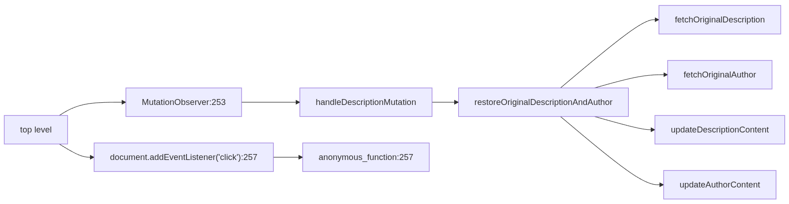

# BirdsEye - Your Code at a Glance
Visualise the relationships between your functions, giving you a high-level overview over your project:


# To clone:
The project uses git submodules, so `git clone` alone will not work. It needs a `--recurse-submodules` flag.

# To run the call graph Mermaid text generator:
1. Go to the `codeScanner` folder
2. Run: `npm ci`
3. Run: `npx tsx main.ts`

## To run it with a debugger (in VSCode):

1. Open VSCode in the `codeScanner` folder (NOT ANY FOLDER ABOVE)
2. Step 1 is important so the correct `.vscode` folder (so `tasks.json` and `launch.json`) gets applied
3. Open `main.ts`
4. Press `F5`, this should run the program, and stop it at any breakpoints you choose

If you don't use VSCode, just run `tsc` in `codeScanner` before debugging it like you do any other Javascript (this is what the VSCode setup does anyway, just with a fancy one button click).

# To run the SvelteKit frontend with the graph text generator:
1. `npm install`
2. `npm run dev`

# Folder structure:
I wanted the two projects to remain independent, since the codeScanner does not need the frontend and in the future it could be used in i.e. GitHub Actions adding mermaid digrams to documentation.

So I needed a good way to import a package I'm building alongside the SvelteKit frontend.
After a bit of digging, I found "npm workspaces". Before that I tried importing from a relative path, but `vite` - the tool building and running SvelteKit dev server - did not like that.

So, "npm workspaces":

```
msoc/
├── readme.md
├── package.json
├── frontend/
│   └── package.json
│   └── src/
└── codeScanner/
    └── package.json
    └── main.ts
```

The root `package.json` specifies the workspaces and defines utility scripts. 
So `npm run dev` (and `npm run build`) works correctly 
(`cd frontend` and `npm run dev` would be a mistake, as it would result in `npm warn config ignoring workspace config at /home/petr/Documents/msoc/codebase overview/frontend/.npmrc`)

```json
{
  "name": "my-monorepo",
  "private": true,
  "workspaces": [
    "codeScanner",
    "frontend"
  ],
  "scripts": {
    "dev": "npm --workspace frontend run dev",
    "build": "npm --workspace frontend run build",
    "scan": "npm --workspace codeScanner run scan"
  }
}
```

Inside "codeScanner" `package.json` I added the `name` entry to make it visible as a dependency:
```json
{
    "name": "code-scanner"
}
```
And I also specified its build scripts for good measure:

```json
  "scripts": {
    "build": "tsc",
    "dev": "tsc --watch"
  }
```

Inside "frontend" `package.json` I had to specify the `code-scanner` dependency.
The `*` means find any version. NPM will find the `code-scanner` in the adjacent "codeScanner" folder (it matches by `name` in `package.json`, not by folder name) and link it thanks to the workspaces config.
Else I would have to run through hoops with `npm link` manually. 

```json
	"dependencies": {
		"code-scanner": "*"
	}
```

The `link` with workspaces happens automatically and it means that to tools like `vite` the import looks just like any other import from npmjs.com published modules in  `node_modules` and it is happy. So `vite` doesn't have the slightest idea that `code-scanner` is instead in reality in an adjacent folder.
Also if I publish this, I would not have to change the import names anywhere.

# To view the generated Mermaid graph
For each file a graph is generated. Paste the graph to [https://mermaid.live](https://mermaid.live)
(There is also [mermaimaidchart.com](mermaimaidchart.com), but the `.live` page is better since it does not require login).

# SvelteKit specific Readme:
Moved from `README.md` file it generated, development info

# sv

Everything you need to build a Svelte project, powered by [`sv`](https://github.com/sveltejs/cli).

## Creating a project

If you're seeing this, you've probably already done this step. Congrats!

```bash
# create a new project in the current directory
npx sv create

# create a new project in my-app
npx sv create my-app
```

## Developing

Once you've created a project and installed dependencies with `npm install` (or `pnpm install` or `yarn`), start a development server:

```bash
npm run dev

# or start the server and open the app in a new browser tab
npm run dev -- --open
```

## Building

To create a production version of your app:

```bash
npm run build
```

You can preview the production build with `npm run preview`.

> To deploy your app, you may need to install an [adapter](https://svelte.dev/docs/kit/adapters) for your target environment.


# Node version 20 or newer is required
For the `glob` package.
```
npm WARN EBADENGINE Unsupported engine {
npm WARN EBADENGINE   package: 'lru-cache@11.1.0',
npm WARN EBADENGINE   required: { node: '20 || >=22' },
npm WARN EBADENGINE   current: { node: 'v18.19.1', npm: '9.2.0' }
npm WARN EBADENGINE }
```
=> My system `node` version was v18.19.1, so I had to use [nvm](https://github.com/nvm-sh/nvm?tab=readme-ov-file#installing-and-updating) to download a newer one (and not break system packages):

```
petr@petr-IdeaPad-3-15ALC6:~$ nvm install --lts
Installing latest LTS version.
Downloading and installing node v22.16.0...
Downloading https://nodejs.org/dist/v22.16.0/node-v22.16.0-linux-x64.tar.xz...
####################################################################################################################################################################################### 100.0%
Computing checksum with sha256sum
Checksums matched!
Now using node v22.16.0 (npm v10.9.2)
Creating default alias: default -> lts/* (-> v22.16.0)
```

```
petr@petr-IdeaPad-3-15ALC6:~$ nvm use --lts
Now using node v22.16.0 (npm v10.9.2)
petr@petr-IdeaPad-3-15ALC6:~$ node --version
v22.16.0
```